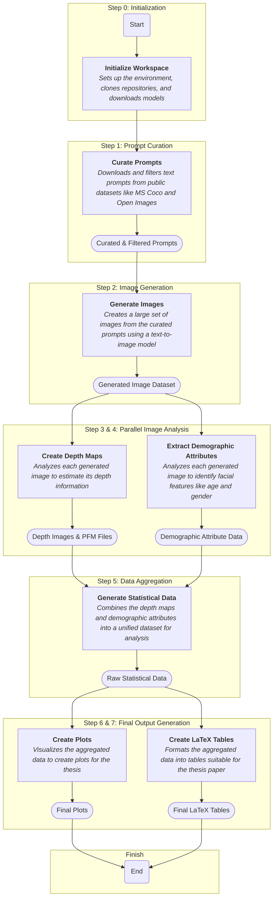

# master-thesis
This is the repository for the master thesis "Uncovering Group Image Representations in Text-Conditional Image Generation."

# Initialization

To initialize the workspace and download everything that is necessary to run the code, run the following:
```console
bash init.sh
```

To make sure all necessary packages are installed, use the created virtual environment in the .venv folder when running the Jupyter Notebooks.


# Running the code to get the final results

## 1. Downloading and curating prompts

To download and curate the necessary prompts, run all cells in the code/prompt_curation.ipynb Jupyter Notebook.

## 2. Create the images

To create the images, run the following scripts in two different terminals:

First start the ComfyUI server that runs the models:
```console
bash scripts/start_comfy_server.sh
```
Wait until the server is up and running.  
Now you can run the ComfyUI client script:

```console
bash scripts/create_img_comfy.sh $1
```

This script requires the path to the result CSV file that contains the prompts.  
This will run for a very long time. To stop it, just press CTRL+C in the terminal.

## 3. Create the depth images and pfms

With the image created, now the depth images and PFMs can be created.  
To create the images, run the following script in a terminal:

```console
bash scripts/run_midas.sh $1 $2
```

The first parameter should be the path to where the generated images are stored, and the second parameter should be the path to where the depth images should be stored.

## 4. Extract demographic attributes with DeepFace

Now the demographic attributes need to be extracted. To achieve this goal, run the following script in a terminal. Before running this script, you need to update the path to the images in the code/extract_facial_features.py file.


```console
bash scripts/extract_demographic_attributes.sh
```

## 5. Generating raw statistical data

With both the PFMs created and the demographic attributes extracted, now the raw statistical data can be generated. To achieve this goal, run all cells in the code/create_statistic_data.ipynb notebook. Here again a few variables pointing to the previous results must be filled.

## 6. Create Plots

With the raw statistical data generated, the plots can be created. To achieve this goal, run all cells in the code/create_plots.ipynb notebook. Here again a variable pointing to the previous results needs to be filled.

## 7. Create LaTeX tables and table figures

With the raw statistical data generated, the LaTeX tables and table figures can be created. To achieve this goal, run all cells in the code/create_latex_tables.ipynb notebook. Here again a variable pointing to the previous results needs to be filled.


## The resulting pipeline




# Results

The extracted raw statistical data is supplied in this repo and can be found in the results folder.